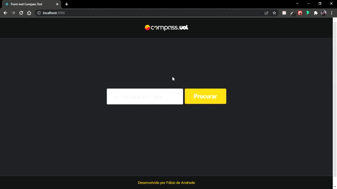

# TESTE FRONTEND - COMPASS

 

### 🎛️ Dependencias
 
- [React Router](https://reactrouter.com/) - Para criação e gerenciamento de rotas
- [Semantic UI React](https://react.semantic-ui.com/) - Para o html semantico gerado pelo react em páginas estáticas
- [Create React App](https://create-react-app.dev/) - Para o ambiente já modelado com webpack, babel e testes (Jest, RTL).

 
### 🎯 Objetivo
Estruturar, modelar e produzir uma aplicação web de acordo com o briefing passado pelo time da Compas Uol.

- Gostariamos de pesquisar por usuario.
- Gostariamos de ao clicar no botão de repos, listar - repositorios do usuario pesquisado.
- Gostariamos de ao clicar no botão de starred, listar os repositorios mais visitados por aquele usuario.
 
 
### ⌨️ Como foi feito?

A ideia inicial criar componentes - junto com suas responsabilidades - separados, para que após as páginas pudessem ser montadas.

Pensando em componentes, optei por usar a biblioteca `Semantic UI React` que durante a geração de página estática, atribui aos elementos um html semântico de acordo com as boas práticas do HTML5.

Uma vez que os componentes já haviam sido criados, foi hora de pensar na criação das páginas e o roteamento delas junto com o `React Router`. Tive um certo problema com a versão da biblioteca em relação à do `create-react-app`, pesquisei uma solução e a mais viável para que não comprometesse o projeto seria efetuar um downgrade na versão do **React Router**, fiz alguns testes e aplicação permaneceu ativa.

A parte visual foi baseada na [home](https://compass.uol/) da Compass Uol, usei duas extensões do Chrome(CollorZila e Fonts Ninja) para capturar a fonte e as cores usasdas pela Compass.

### 🔎 Como utilizar - Ambiente de desenvolvimento

- Dê um `git clone` no link do repositório.
- Instale as dependencias através do `npm i`.
- Execute no **Localhost:300** através do `npm start`

- No campo de busca principal você podera buscar o `user` de qualquer usuário do GitHub para que uma página com as informações desse usuário surja na tela.
- Com as informações abertas, você podera navegar pelos botôes de `repositório` e `estrelados` para colher informações mais detalhadas do usuário.

 
### 🔧 Próximos passos
 
- Corrigir pequenos conflitos entre o CSS nativo e o inputado pelo `Semantic UI React`.
- Migrar o projeto para Next.js afim de melhorar sua performance assim como ter a possibilidade de gerenciar a página em parâmetros de SSR.
- Varrer 100% de Coverage em testes unitários.
- Corrigir o erro da paginação ao acessar a segunda página - caso haja. 
- Ajustar os erros de Deploy na Vercel

### GitHub OAhtu
fcba6c47e41e7597e905

### 🎨 Autor

[LinkedIn](https://www.linkedin.com/in/fabiodeandrad/) 
[Medium](https://medium.com/@fabioscript)
[E-mail](fabiodeandradecontato@gmail.com)
